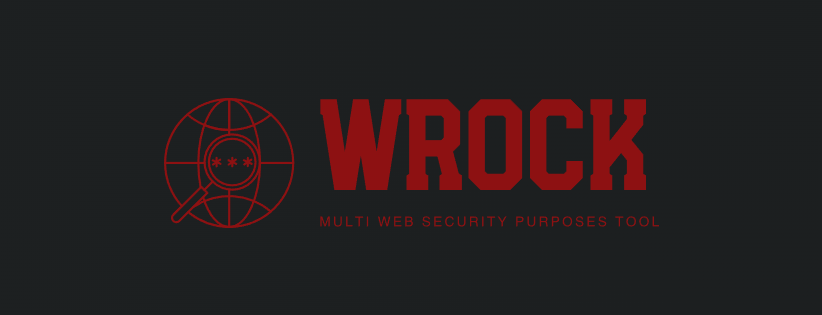

<h1 align="center">WRock</h1>


<p align="center">
  
</p>

> WRock is a professional and powerful tool specifically crafted for modern web security. It provides comprehensive capabilities for advanced web scanning, intelligent web crawling, and thorough subdomain enumeration. As supports sophisticated fuzzing capabilities.

## Features

- Scan web applications to detect vulnerabilities with fast, automated assessments, supporting customizable vulnerability inclusion/exclusion
- Crawl websites to map structures, uncover hidden paths, and extract insights using a smart, configurable engine with adjustable depth and subdomain support
- Enumerate subdomains using Subfinder and Sublist3r to expand attack surfaces, with options for recursive discovery and source customization
- Analyze JavaScript files for sensitive data and vulnerabilities, with platform- and key-specific extractors, plus detailed report generation
- Fuzz URLs, headers, cookies, and post data with ffuf-powered, high-performance fuzzing, offering customizable wordlists, matchers, and recursion strategies

## Uses modified versions of
- [Sublist3r](https://github.com/aboul3la/Sublist3r)
- [Subfinder](https://github.com/projectdiscovery/subfinder)
- [RockRawler](https://github.com/0xNinjaCyclone/RockRawler)
- [Ffuf](https://github.com/ffuf/ffuf)

## Installation

**Get started with WRock by following these steps:**

```
git clone https://github.com/0xNinjaCyclone/WRock.git
cd WRock
chmod 755 install.sh
sudo ./install.sh
```

## Example usages
```
┌──(user㉿hostname)-[~/path/to/WRock]
└─$ python3 webrock.py 

            Fight Bugs                      |     |
                                            \\_V_//
                                            \/=|=\/
                                             [=v=]
                                           __\___/_____
                                          /..[  _____  ]
                                         /_  [ [  M /] ]
                                        /../.[ [ M /K] ]
                                       <-->[_[ [M /C/] ]
                                      /../ [.[ [ /O/ ] ]
                 _________________]\ /__/  [_[ [/R/ C] ]
                <_________________>>0---]  [=\ \W/ C / /
                   ___      ___   ]/000o   /__\ \ C / /
                      \    /              /....\ \_/ /
                   ....\||/....           [___/=\___/
                  .    .  .    .          [...] [...]
                 .      ..      .         [___/ \___]
                 .    0 .. 0    .         <---> <--->
              /\/\.    .  .    ./\/\      [..]   [..]
             / / / .../|  |\... \ \ \    _[__]   [__]_
            / / /       \/       \ \ \  [____>   <____]
        

		./webrock.py [-h or --help] for more options

```
**Help menu**
```
┌──(user㉿hostname)-[~/path/to/WRock]
└─$ python3 webrock.py -h
Usage: 
		./webrock.py [-h or --help] for more options 


Options:
  -h, --help            show this help message and exit
  -t TARGET, --target=TARGET
                        Enter The Target Url|Domain
  -m MODE, --mode=MODE  mode [r|recon - s|scan - c|crawl - a|jsanalyze -
                        f|fuzz] (default mode = scan)
  -T THREADS, --threads=THREADS
                        Set Number Of Threads (default = 5)
  -H HEADERS, --headers=HEADERS
                        Custom headers separated by two semi-colons. E.g. -h
                        "Cookie: foo=bar;;Referer: http://example.com/" Or
                        File
  -i INCLUDED_MODULES, --include=INCLUDED_MODULES
                        Include specified vulnerabilities for scanning EX
                        'sqli,ssrf' (Note add minus before source to exclude
                        EX '-xss')
  -p POST, --post-params=POST
                        Post params ('p1=v1&p2=v2|param_type')
  -f FORMAT, --format=FORMAT
                        Output format ('text' by default)
  -o OUTPUT, --output=OUTPUT
                        Enter FileName for save output in it
  -v, --verbose         Increase verbosity
  -l LEVEL, --level=LEVEL
                        verbosity level [1-3]
  -V, --version         Show version

  Modules options:
    --burp-collaborator=COLLABORATOR
                        Set Collaborator server host to detect blind vulns EX
                        (host.burpcollaborator.net)
    --xsshunter=XSSHUNTER
                        xsshunter url EX (https://hacker.xss.ht)

  Crawler options:
    --depth=DEPTH       Depth to crawl. (default = 5)
    --subs              Include subdomains in crawling
    --insecure          Disable TLS verification
    --no-crawl          Don't use crawler for scanning or analysis js files
                        (use the main url)
    --get-sc            Get status code of crawled urls
    --no-outofscope     Exclude out of scope pages
    --disallowed=DISALLOWED
                        comma-separated disallowed urls filter, accept regex

  Subdomain collector options:
    --sources=SOURCES   Enumerations Sources separated by comm (Note add minus
                        before source to exclude)
    --timeout=TIMEOUT   Time out (default = 30)
    --subfinder-apis=SUBFINDER_APIS
                        yamlfile or submit in this format ->
                        'Source1:API1+API2,Source2:API1'
    --subfinder-all     Use all sources
    --maxEnumerationTime=MAXENUMERATIONTIME
                        Minutes to wait for enumeration results (default = 10)
    --recursive         Collect recursivly
    --sublist3r         Use sublist3r
    --revip             Reverse IPs all collected subdomains

  Js Analyzer options:
    --by-platform=BY_PLATFORMS
                        Use specific extractors by comma-sperated platforms
                        EX(Google,GitHub,General)
    --by-key=BY_KEYS    Use specific extractors by comma-sperated keys type
                        EX(APIKey,OAuth,JWT)

  Fuzzer options:
    --wordlists=WORDLISTS
                        Wordlist file path and (optional) keyword separated by
                        colon. eg. '/path/to/wordlist:KEYWORD'
    --method=METHOD     HTTP method to use.
    --matchers=MATCHERS
                        dash-separated matchers in this format
                        'matcherName:MatcherValue1,MatcherValue2-...'
                        EX(mc:all)
    --filters=FILTERS   dash-separated filters in this format
                        'filterName:filterValue1,filterValue2-...'
    --input-mode=INPUTMODE
                        Multi-wordlist operation mode. Available modes:
                        clusterbomb, pitchfork, sniper (default: clusterbomb)
    --matcher-mode=MATCHERMODE
                        Matcher set operator. Either of: and, or (default: or)
    --filter-mode=FILTERMODE
                        Filter set operator. Either of: and, or (default: or)
    --strategy=STRATEGY
                        Autocalibration strategy: 'basic' or 'advanced'
                        (default: basic)
    --fuzz-recursion    Scan recursively. Only FUZZ keyword is supported.
    --recursion-depth=FDEPTH
                        Maximum recursion depth.
    --recursion-strategy=FSTRATEGY
                        Recursion strategy: 'default' for a redirect based,
                        and 'greedy' to recurse on all matches (default:
                        default)


```
**Perform scanning**
```
python3 webrock.py -t http://target.com/
python3 webrock.py -t http://target.com/ -i "-xss" # exclude xss
```

**Perform subdomain enumeration**
```
python3 webrock.py -t target.com -m recon
python3 webrock.py -t target.com -m r --sublist3r 
```

**Perform both** (collect subdomains and scan each subdomain)
```
python3 webrock.py -t target.com -m r+s
python3 webrock.py -t target.com -m r+s -o results.txt
```

**Perform crawling**
```
python3 webrock.py -t http://target.com/ -m crawl
python3 webrock.py -t http://target.com/ -m c --depth 2 --subs -o urls.txt
```

**Perform analysis** (collect all js files and extract sensitive data)
```
python3 webrock.py -t https://target.com/ -m jsanalyze
python3 webrock.py -t https://target.com/ -m a --by-platform Google,GitHub,General
```
**Perform Fuzzing**
```
python3 webrock.py -t https://target.com/FUZZ -m fuzz --wordlists path/to/wordlist.txt
python3 webrock.py -t https://target.com/FUZZ -m f --wordlists path/to/wordlist.txt --matchers mc:404,200-ms:469,5474 --matcher-mode and

# brute force 
python3 webrock.py -t "http://hostname/dvwa/vulnerabilities/brute/?username=USER&password=PASSWD&Login=Login" -m f --wordlists path/to/users.txt:USER,path/to/pass.txt:PASSWD --matchers mc:200 --filters fr:incorrect -H "Cookie: security=low; PHPSESSID=Value"
```

Read [the official documentation](https://github.com/0xNinjaCyclone/WRock/wiki) for more details.

## Important Notes

* Please Note: WRock is currently under development, and additional features and enhancements will be added in future updates. We appreciate your understanding and patience as we continue to improve and expand the capabilities of the tool.
  
* WRock is intended for educational and security research purposes only. By using this tool, you acknowledge that you are responsible for complying with all applicable laws and regulations. The developers and contributors of WRock assume no liability and are not responsible for any misuse or damage caused by the tool. Use at your own risk.


